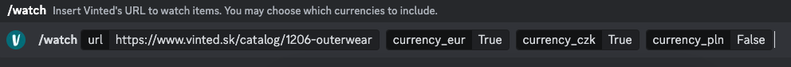

### Brief info
The `vinted_go` application serves as an agent for items being posted to Vinted marketplace. The app can filter the nationality of sellers (Poland, Czech or Slovak) posting the items. 

After running the `vinted_go`, you can see the Discord bot online. if so, enter any url of vinted marketplace you wish to be notified about and wait for new items.  

*discl.: app was tested only for `https://wwww.vinted.sk` domain*

### How to run locally
*requirements:* 
- go >1.24
- Discord
- Linux OS

1. Fill the `.env` file as the `.env_example` says
2. `cd` into repository
3. `go build -ldflags "-s -w"`
4. `./vinted_go`

### Docker
*requirements:*
- running docker

1. `docker build -t vinted_go_img .`
2. `docker run -d -it --rm --name vinted_go_running vinted_go_img`

To see logs:
- `docker logs  -f vinted_go_img`
To enter the container's shell:
- `docker container exec vinted_go_img bash`

### Authors
smatand